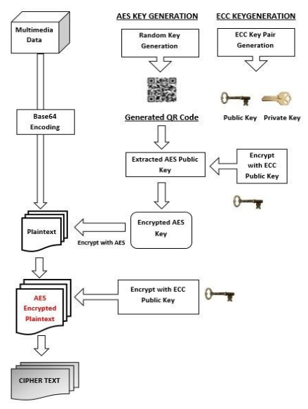

# hybrid-cryptography
# 🔐 Hybrid Cryptography System (AES + ECC)

A **hybrid cryptography system** that combines **AES (Advanced Encryption Standard)** for fast symmetric encryption and **ECC (Elliptic Curve Cryptography)** for secure key exchange and asymmetric encryption.

This project was developed as part of **Project-Based Learning (PBL)** for **B.Tech CSE (3rd Semester)** at **Graphic Era Hill University**.

---

## 🧠 Overview

This project focuses on securing multimedia data (text, image, audio, video, PDF) through a **two-layer encryption system**:
- **AES** (128/192/256-bit) → used for encrypting the main data quickly and efficiently.  
- **ECC/ECIES** → used to securely encrypt and exchange the AES key.  

It also uses **Base64 encoding** and **compression** to prepare data for secure transmission or storage.

---

## 🧩 Project Workflow

### **1️⃣ Data Preparation**
- Convert multimedia input into **Base64 encoded** form.  
- Compress and store as a text file for encryption.

### **2️⃣ Key Generation**
- Generate **AES key** (symmetric).  
- Generate **ECC key pair** (public and private).  
- Optionally generate a **QR code** of AES key for easy transfer.

### **3️⃣ Encryption Module**
- Encrypt AES key using **ECC public key**.  
- Encrypt Base64 data using **AES**.  
- Optionally encrypt AES-encrypted file again with **ECC** (2nd level).  
- Generate final **Cipher Text**.

### **4️⃣ Decryption Module**
- Decrypt AES key using **ECC private key**.  
- Use decrypted AES key to decrypt Cipher Text.  
- Decode Base64 to get back original multimedia data.

### **5️⃣ Data Recovery**
- Decompress decrypted file.  
- Convert Base64 back to original data format.

---

## ⚙️ Architecture

### 🔸 Encryption Process


### 🔸 Decryption Process


---

## 💻 Technologies Used

| Category | Technology |
|-----------|-------------|
| **Language** | Python 3 |
| **Symmetric Encryption** | AES (via `pycryptodome` / `cryptography` library) |
| **Asymmetric Encryption** | ECC / ECIES |
| **Data Encoding** | Base64 |
| **Compression** | zlib / gzip |
| **QR Code Generation** | qrcode |
| **Hashing** | SHA-256 |

---

## 📂 Project Structure

📦 hybrid-cryptography/
│
├── 📁 src/ # Source code
│ ├── encrypt.py # Encryption module
│ ├── decrypt.py # Decryption module
│ ├── keygen.py # Key generation
│ └── utils.py # Helper functions (Base64, compression)
│
├── 📁 images/ # Architecture and workflow diagrams
│
├── 📁 test_files/ # Sample input data (images/text/audio)
│
├── 📄 requirements.txt # Python dependencies
└── 📄 README.md # Project documentation        

 
---

## 🚀 How to Run

### 🧩 Step 1 — Setup Environment
```bash
git clone https://github.com/<your-username>/hybrid-cryptography.git
cd hybrid-cryptography
pip install -r requirements.txt
```
🔑 Step 2 — Generate Keys
python src/keygen.py


This will generate:

AES Key

ECC Public and Private Keys

(Optional) QR Code of AES Key

🔐 Step 3 — Encrypt File
python src/encrypt.py --input test_files/sample.txt --output cipher.txt


Encrypts the Base64 and compressed input file using AES and ECC.

🔓 Step 4 — Decrypt File
python src/decrypt.py --input cipher.txt --output recovered.txt


Decrypts Cipher Text using ECC private key and AES key to restore original data.   
🔒 Key Features

Hybrid AES + ECC encryption for high security.

Secure AES key exchange using ECC.

Optional second-layer ECC encryption.

Supports text, image, audio, video, and PDF files.

Base64 encoding + compression for efficient transfer.

Modular Python design with reusable functions.

🧠 Advantages

Combines speed of AES with security of ECC.

Lower computational cost than full asymmetric encryption.

Suitable for cloud security, multimedia encryption, and file sharing.

Scalable and easily extendable Python implementation.

📊 Results

Encrypted and decrypted multimedia data successfully.

AES key safely transmitted via ECC encryption.

Ciphertext verified to produce exact original data after decryption.

Demonstrated efficient hybrid cryptosystem performance.

🏫 Academic Information

Project Type: Project-Based Learning (PBL)
Course: B.Tech – Computer Science & Engineering
Semester: 3rd
University: Graphic Era Hill University
Title: Hybrid Cryptography Using AES and ECC

👨‍💻 Contributors

-mohit chamoli
-aditya sajwan
-neelesh gusain

Under guidance of [saksham mittal]

📦 requirements.txt

If not already present, create a requirements.txt file with:

cryptography
pycryptodome
qrcode
zlib
gzip
base64


Install dependencies:

pip install -r requirements.txt

🧾 References

International Journal of Computer Applications (0975–8887): “Hybrid Cryptography using AES and ECC”

AES (Advanced Encryption Standard) – NIST FIPS Publication 197

ECC (Elliptic Curve Cryptography) – ECIES Standards

Python Libraries: cryptography, pycryptodome, qrcode

⭐ If you find this project useful, don’t forget to star the repository!
